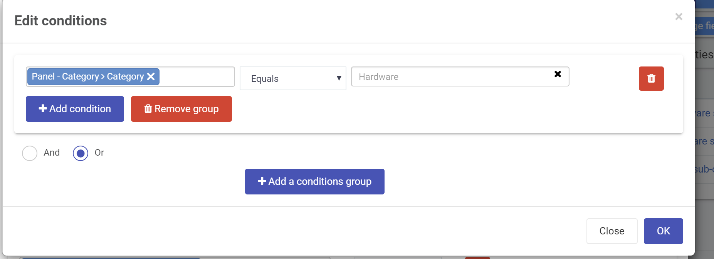

# Introduction to rules with Kianda

> [!WARNING]
> This documentation is still in progress and might change at any stage.

Busines rules is what makes Kianda forms come to live. They represent the actual actions users intend to perform when they interact with form components.

> There are more 56 default business rules in Kianda and you might easily create more

Business rules in fall within categories

- **Workflow** - Enable you to execute actions that might change to flow of information within a process. From hidding a field to changing the flow on a multi-step process.
- **Communications** - Enable sending emails or meeting requests or even user (push) notifications
- **Data** - This is an important and flexible rule group because it allows you to configure CRUD (Create, Read, Update and Delete) actions to configured datasources.
- **File Management** - Allows operations such as generation of a work document and conversion to PDF and more.
- **Tables** - Provides specialised rules to enable working with tables like sorting tables, copying table rows to another table and more.
- **Dates** - Enable conveniente date calculation with advanced options like ignoring weekends or special dates.

## Conditions

Flexible and dynamic conditions form an important component to make forms fully dynamic. It enables you create in natural language conditions when rules should trigger.

## Workflow rules

> [!WARNING]
>
> In Progress

## Data rules

> [!WARNING]
>
> In Progress

## Custom rules

> [!WARNING]
>
> In Progress

## Advanced techniques

> [!WARNING]
>
> In Progress

