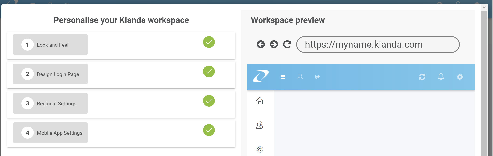
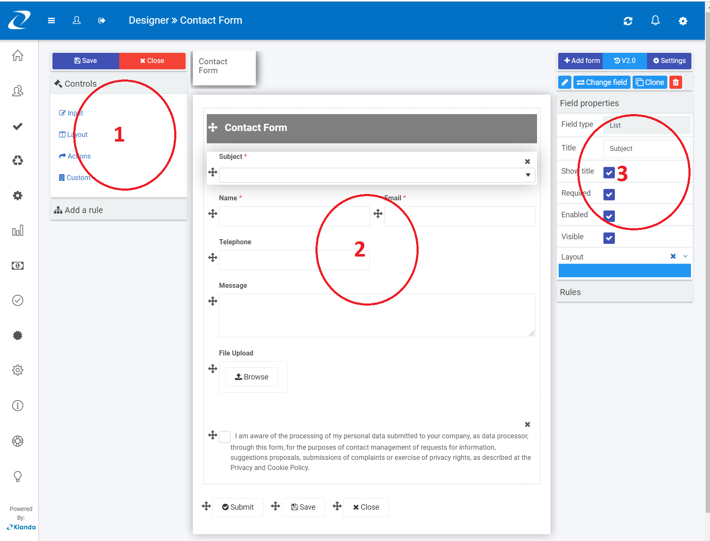
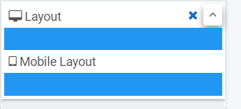
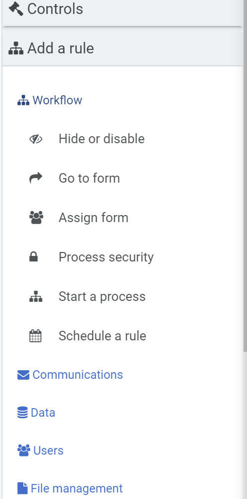

## Setup your workspace

To help you get started quickly and set-up your digital process workspace follow these steps:

If you did not do so yet please signup for free at https://app.kianda.com/signup.

Once you confirm your email address and sign-in for the first time you will be prompted to finalise the configuration of your digital process workspace as shown below.

1. Define your brand colours and logos under look and feel.
2. Apply a design style to your workspace Login page.
3. Define your regional settings and time-zone.
4. Configure the mobile app (PWA) settings.

> On completion of this guide, you will get a fully customised digital process workspace at https://&lt;businessName&gt;.kianda.com ready for you and your co-workers to use.
>

## Creating your first process

Once you have setup your identity you should be able to quickly progress to start creating quick forms or full-blown processes with Kianda.

Creating your first process in Kianda starts with designing your first form.

Because Kianda is a forms-based process automation platform it all starts with a form. It might be a simple contact form or something else more complex, but soon you will be able to add more forms like "Follow-up form" or even a "Closure form".

Although Kianda aims to be intuitive and easy to get started it is never difficult to over-engineer. So at Kianda we always recommend doing some simple planning before you design your first form.

It could be something as simple as a quick flow chart or as we use a spreadsheet where you quickly log the key components, fields or rules that should be needed in the process.

In general, we normally include the following key steps to build a process in an agile manner:

1. Plan process design, forms, fields, rules, log into design spreadsheet.
2. Build forms and fields connecting to data where applicable.
3. Publish to dashboards, anonymous forms or SharePoint for end-user distribution.
4. Repeat until perfect.

When you are ready, navigate to https://&lt;businessName&gt;.kianda.com/admin/designer then click "Add new" to create a new process.

***Platform getting started video***

<video width="100%" style="width:100%" controls>
    <source src="videos/Kianda-get-started.mp4">
    Your browser does not support the video tag.
    </source>
</video>

## Form designer

Kianda [form designer](form-designer.md) provides an intuitive interface where both technical users and non-technical users can quickly build forms for a multitude of use cases.

The key components of the form designer are:

1. Left side panel containing both **controls** and **types of rules** that can be added to forms.
2. The central area where the current **form canvas** is displayed.
3. The right panel that displays currently selected component **properties** and rules.

***Form designer key components***

### Responsive form layout

Form fields are made with a mobile-first approach giving you a one-time design once and deploy everywhere opportunity.

By using the **Layout** option under the property panel you will be able to quickly define the layout of your fields or panels within a form. Clicking on the **ⱽ** quickly uncovers the layout mode for desktop and mobile.

This allows you to specify a layout made of 1 to 12 columns and is based on bootstrap, a popular CSS  framework that allows designing web interfaces with mobile-first approach.

### Types of fields

Kianda comes with a number of pre-defined field widgets. In case none of them satisfies your specific needs and if you have some level of [development](development.md) skills you can always create your own custom field widget.

At the time of writing the default fields fall into 4 main categories of fields:

1. **Input** - Input fields include the most common data input fields such textbox, user picker, dates, tables checkbox and number fields.
2. **Layout** - Layout fields are fields that serve the purpose perfecting the layout your form. They include responsive panels, dialog box and rich text fields.
3. **Action** - Action fields are fields that allow user interface action like buttons, links or even signature components.
4. **Custom**  - Under custom fields, you will find any custom-developed fields available under your developer section.

[Learn more about the form designer](form-designer.md)

## Dynamic rules

Building interfaces with the form designer is quick intuitive. Making it interactive is a breeze. 

Simply select any form component or even the whole process then under rules click to add a new rule.

## Connect to your data

Kianda comes with a pre-defined set of data-connectors. A few of them are Office 365, SharePoint, Saleforce, DocuSign, SAP and more. 

However, using SOAP or REST service you could easily connect with a datasource that doesn't exist in our pre-defined list.

## Publishing a process

Kianda form designer comes with a intiutive interface to quickly Save and Publish any designs. The below are the options available for you to Save and Publish a process.

1. **Bulk update process instances?** - If this is set to be Yes, then you could select the process instances to be updated with the latest changes in the design.  If No, this could just save the latest changes and publish to a new version.
2. **Trigger field rules after design update?** - If this option is set to be Yes, then you could set a rule or rules to be executed after the design is updated which will also update the existing instance for this process.
3. **Update all instances?** - If this is set to be Yes, then you could update the process and apply those changes on all the existing instances of the process.

