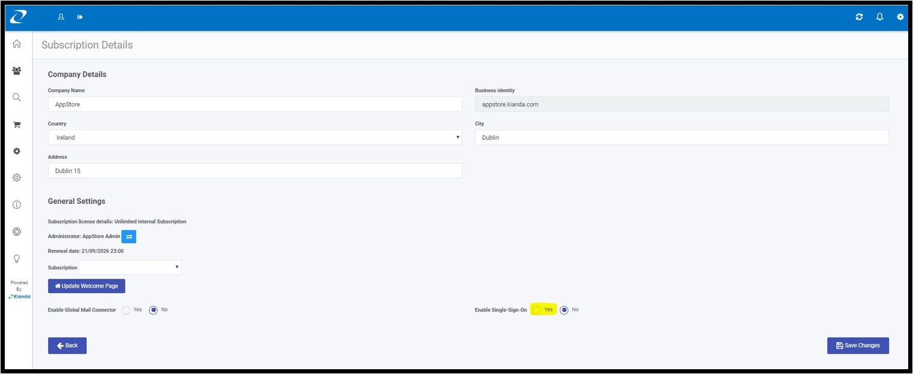

# Office365 Single Sign On (SSO)

## Enable Single Sign On with AzureAD / Office 365

## Integrate with Office 365

## Sync with Active Directory

## User groups

## User roles

### Enable / Disable Single-Sign-On 

*Note: If the Single-Sign-On is already enabled and if you wish to disable it. Try to clear the cache memory and* *login to* Kianda by entering *your password first and then the username.*  

Enabling Single-Sign-On allows the user to login via Single-Sign-On connector. This connector could be SharePoint, Office365 or anything else. To enable Single-Sign-On, please follow the below steps: 

1. Login to Kianda (the user most be of Admin role). 

1. Under the left navigation click on Administration [Symbol] Subscription. 

1. On the right side of the page ‘Enable Single-Sign-On’ to Yes. As shown below. 

